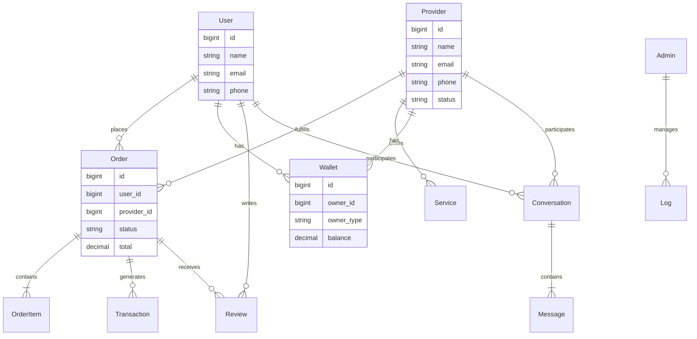

# Project Documentation

## 1. Project Overview
This project is a service-marketplace application built with **Laravel 12** and **Inertia.js v2**. It facilitates interactions between Users (Customers) and Providers (Service Providers/Vendors), managed by Administrators. The system includes features for order management, real-time messaging, wallet transactions, and extensive back-office administration.

## 2. Technology Stack

### Backend
- **Framework**: Laravel 12 (PHP 8.4)
- **Database**: MySQL
- **Real-time**: Laravel Reverb (WebSocket server)
- **Authentication**: Laravel Fortify & Sanctum
- **Testing**: pestphp/pest v3

### Frontend
- **Framework**: React v19
- **Adapter**: Inertia.js v2 (Server-side routing, client-side rendering)
- **Styling**: Tailwind CSS v4
- **UI Components**: Livewire Flux (likely for backend UI) / Custom React Components
- **State Management**: React Hooks & Inertia Form Helpers

### Key Packages
- `laravel/framework`: Core framework
- `inertiajs/inertia-laravel`: Connecting Laravel with React
- `laravel/reverb`: Real-time capabilities (Chat, Notifications)
- `laravel/sanctum`: API token management
- `laravel/fortify`: Backend authentication scaffolding
- `pestphp/pest`: Testing framework

## 3. Directory Structure

### Core Directories
- **`app/`**: Contains the core code of the application.
    - **`Models/`**: Eloquent models representing database tables (`User`, `Provider`, `Order`, `Wallet`, etc.).
    - **`Http/Controllers/`**: Handles incoming HTTP requests.
    - **`Services/`**: Business logic layer (if applicable).
- **`resources/`**: Frontend assets.
    - **`js/`**: React application source code (Pages, Components, Hooks).
    - **`views/`**: Blade templates (mostly entry points for Inertia).
    - **`css/`**: Tailwind CSS configuration and styles.
- **`routes/`**: Route definitions (`web.php` for UI, `api.php` for external APIs, `channels.php` for WebSockets).
- **`database/`**: Migrations, factories, and seeders.
- **`tests/`**: Automated tests (`Feature` and `Unit` tests).

## 4. Database Analysis

The database is structured around three main actors: **Users**, **Providers**, and **Admins**.

### Core Entities

#### Actors
- **`users`**: End-customers who request services.
- **`providers`**: Service providers who fulfill orders.
- **`admins`**: System administrators with RBAC (Role-Based Access Control).

#### Service flow
- **`orders`**: The central entity linking Users and Providers. Tracks the status of a service request.
- **`job_offers`**: (Likely) Offers made by providers or requestable jobs.
- **`reviews`**: Feedback system (`user_reviews`, `provider_reviews`).

#### Financials
- **`wallets`**: Centralized wallet table or separate tables (`user_wallets`, `vendor_wallets` - *Note: Schema shows specific wallet tables*).
    - *Observed in models: `Wallet`, `AdminWallet`, `ProviderWallet` likely exist or are managed via the `Wallet` morph/type.*
    - **`transactions` / `wallet_transactions`**: History of money movement.
    - **`withdraw_requests`**: Process for providers to cash out.

#### Communication
- **`conversations`**: Chat threads between users and providers.
- **`messages`**: Individual messages within conversations.

### Database ER Diagram

The following diagram illustrates the high-level relationships between the core entities.

## 5. Summary of Relationships
- **User vs Provider**: A User orders services; A Provider fulfills them. They communicate via Conversations.
- **Financial Flow**: Orders generate Transactions which update Wallets. Wallets can be topped up (TopUpRequest) or withdrawn from (WithdrawRequest).
- **Categorization**: Services and Providers are likely organized by `Categories` and `Skills`.

